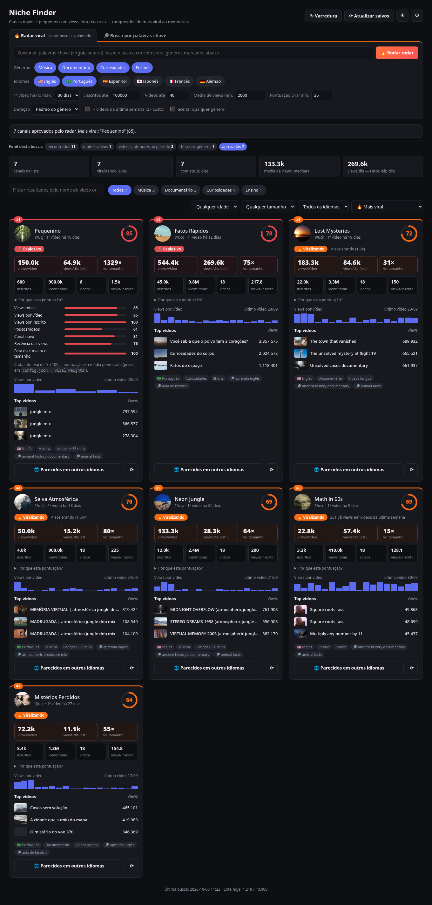
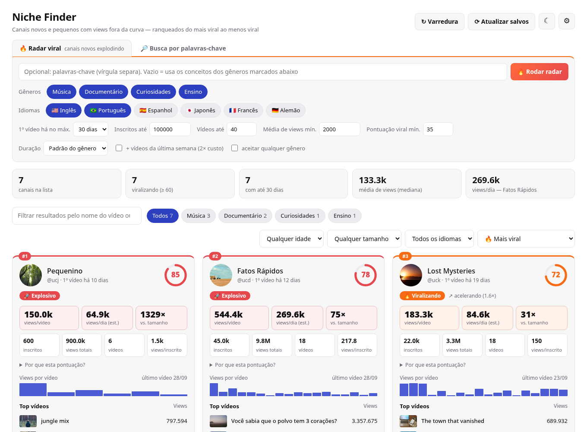

# 🎯 Niche Finder

**Encontre canais do YouTube recém-criados, pequenos e que já estão viralizando** — ranqueados do mais viral ao menos viral — nos nichos de **Música**, **Documentário**, **Curiosidades** e **Ensino**, em português, inglês e espanhol.

É uma ferramenta local: roda no seu computador, usa a sua própria chave gratuita da YouTube Data API v3 e mostra tudo num dashboard web com modo claro e escuro.



---

## Sumário

- [Por que usar](#por-que-usar)
- [Funcionalidades](#funcionalidades)
- [Screenshots](#screenshots)
- [Requisitos](#requisitos)
- [Instalação](#instalação)
- [Como obter a chave da YouTube Data API](#como-obter-a-chave-da-youtube-data-api)
- [Uso](#uso)
- [Como funciona](#como-funciona)
- [Configuração (`config.json`)](#configuração-configjson)
- [Cota da API](#cota-da-api)
- [Estrutura do projeto](#estrutura-do-projeto)
- [API local (endpoints)](#api-local-endpoints)
- [Testes e modo demonstração](#testes-e-modo-demonstração)
- [Privacidade e segurança](#privacidade-e-segurança)
- [Limitações conhecidas](#limitações-conhecidas)
- [Solução de problemas](#solução-de-problemas)
- [Contribuindo](#contribuindo)
- [Licença](#licença)

---

## Por que usar

Um canal **criado há poucas semanas** que já tem milhares de inscritos e centenas de milhares de views é um sinal forte de que o nicho **tem demanda e ainda não está saturado**. O Niche Finder automatiza a busca por esses canais e mostra:

- quais nichos estão gerando canais novos que crescem rápido;
- quais vídeos puxaram esse crescimento;
- se o mesmo nicho já existe (ou ainda não existe) em outros idiomas.

## Funcionalidades

| | |
|---|---|
| 🔥 **Radar viral** | Aba principal. Procura vídeos que estão bombando no período e aprova só canais **novos** (1º vídeo há ≤ 30 dias), **pequenos** (≤ 100 mil inscritos), com **poucos vídeos** (≤ 40) e views muito acima do esperado. Resultado em cards ranqueados do mais viral ao menos viral. |
| 🚀 **Pontuação viral (0–100)** | 7 fatores: views totais, views por vídeo, views por inscrito, poucos vídeos, idade do canal, recência das views e desempenho fora da curva para o tamanho. Cada card mostra a barra de cada fator em "Por que esta pontuação?". |
| ⟳ **Crescimento medido** | "Atualizar salvos" recheca os canais por ~3 unidades cada (sem buscas de 100). A partir da 2ª checagem o card mostra as **views/dia reais** entre as checagens, em vez da estimativa. |
| 🆕 **Só canais novos de verdade** | O **primeiro vídeo** do canal precisa ter sido publicado dentro do período (padrão: 30 dias). Canais antigos que voltaram a postar e canais com vídeos importados ficam de fora. |
| 📈 **Performance alta** | Filtra pela **média de views por vídeo** (padrão: 3.000) e views por inscrito. O número de inscritos **não** é filtrado: um canal com 200 inscritos e 30 mil views por vídeo aparece. |
| 🎼 **Gênero detectado pelo conteúdo** | Usa a categoria de cada vídeo, os tópicos que o YouTube atribui ao canal e palavras-chave nos títulos. Pega canais de música publicados como "Pessoas e blogs" e não deixa um vlog passar como "documentário". |
| 🔑 **Busca por palavras-chave** | Digite palavras-chave ou o nome de um vídeo. O app traduz para os idiomas marcados (mantendo termos como *dnb*, *jungle*, *lofi*, *mix*), mostra as buscas e o custo, e só então busca no YouTube. Dá para filtrar por gênero e duração (ex.: mixes longos). |
| 🌐 **Parecidos em outros idiomas** | Com um clique, extrai o estilo dos títulos dos vídeos mais vistos do canal (ex.: `VIRTUAL MEMORY 2003 (atmospheric jungle dnb mix)` → *atmospheric jungle dnb mix*), traduz e busca canais parecidos nos outros idiomas. |
| 🧮 **Funil de filtros** | Toda busca mostra quantos canais caíram em cada filtro, para saber o que afrouxar quando vier pouco resultado. |
| 🏆 **Nota de oportunidade (0–100)** | A nota original continua calculada e disponível na ordenação "Nota antiga". |
| 🌗 **Modo claro e escuro** | O tema escolhido fica salvo no navegador. |
| 💸 **Controle de cota** | Mostra o custo estimado antes de cada busca, guarda respostas em cache por 12 h e conta o uso diário. |
| 📦 **Zero dependências** | Apenas a biblioteca padrão do Python 3.10+. Nada de `pip install`. |

## Screenshots

| Radar viral (claro) | Busca por palavras-chave | Similares em outros idiomas | Configurações |
|---|---|---|---|
|  |  |  |  |

> As imagens usam **dados de demonstração** (canais fictícios gerados pelos testes), não canais reais.

## Requisitos

- **Python 3.10 ou mais recente** (Linux, macOS ou Windows)
- Um navegador moderno
- Uma **chave gratuita da YouTube Data API v3** ([como obter](#como-obter-a-chave-da-youtube-data-api))

Nenhuma biblioteca externa é necessária.

## Instalação

```bash
git clone https://github.com/<seu-usuario>/niche-finder.git
cd niche-finder
```

Pronto. Não há dependências para instalar.

## Como obter a chave da YouTube Data API

1. Acesse o [Google Cloud Console](https://console.cloud.google.com/) e faça login.
2. Crie um projeto novo (menu do topo → **Novo projeto**).
3. Vá em **APIs e serviços → Biblioteca**, procure **YouTube Data API v3** e clique em **Ativar**.
4. Vá em **APIs e serviços → Credenciais → Criar credenciais → Chave de API**.
5. (Recomendado) Clique na chave criada e, em **Restrições de API**, limite o uso à **YouTube Data API v3**.

A chave é gratuita e vem com **10.000 unidades de cota por dia**. Não é preciso cadastrar cartão para usar só essa API.

## Uso

### 1. Inicie o servidor

```bash
# Linux / macOS
./iniciar.sh

# qualquer sistema
python3 server.py        # no Windows: python server.py
```

O navegador abre em **http://127.0.0.1:8765**.

Opções:

```bash
python3 server.py --port 9000       # usa outra porta
python3 server.py --no-browser      # não abre o navegador automaticamente
python3 server.py --scan            # faz uma varredura completa pelo terminal, sem interface
python3 server.py --radar --langs en,pt                     # Radar viral pelo terminal (ranking do mais viral)
python3 server.py --radar --keywords "liquid dnb mix" --days 60   # Radar com palavras-chave
python3 server.py --like "https://www.youtube.com/@canal" --langs en,pt   # canais novos e virais parecidos com um canal
python3 server.py --keywords "atmospheric jungle mix, liquid dnb" --langs en,pt   # busca por palavras-chave pelo terminal
python3 server.py --scan --days 60  # muda a idade máxima do 1º vídeo
```

### 2. Configure a chave

Clique em **⚙ Configurações**, cole a chave e clique em **Salvar chave**. O app testa a chave na hora (custa 1 unidade de cota) e mostra se ela funcionou.

A chave é salva em `~/.config/niche-finder/.env`, fora da pasta do projeto, com permissão só para o seu usuário. Também dá para defini-la por variável de ambiente:

```bash
export YT_API_KEY="sua-chave"
```

### 3. Busque canais

| Ação | O que faz | Custo aproximado |
|---|---|---|
| **Buscar canais** (palavras-chave) | Busca cada palavra-chave em cada idioma marcado (traduzida) | 100 unidades por palavra-chave × idioma |
| **🌐 Canais parecidos em outros idiomas** | Busca o estilo do canal, traduzido, nos idiomas marcados | 100 unidades × até 2 buscas × idioma |
| **↻ Varredura** | Busca todos os conceitos do `config.json` nos idiomas marcados em Configurações | ~3.000 unidades (PT + EN) |

Antes de gastar cota, o app sempre mostra **as buscas que vai fazer (já traduzidas)** e o custo estimado. Na busca por palavras-chave, o primeiro clique mostra o plano e o segundo (**Confirmar busca**) executa.

#### Dicas para música

Use o estilo como aparece nos títulos dos canais que você quer encontrar, e marque **Duração: Longos** para mixes:

```
atmospheric jungle dnb mix, liquid dnb mix, atmospheric breakcore mix, ps2 nostalgia jungle mix
```

Nos critérios da tela principal, você pode ajustar a idade máxima do 1º vídeo (30, 60, 90 ou 180 dias) e a média mínima de views. Esses valores ficam salvos no navegador.

### 4. Explore os resultados

- **Filtrar resultados:** digite parte do nome de um vídeo ou canal para filtrar na hora, sem gastar cota. O vídeo que bateu com a busca fica destacado no card.
- **Chips de gênero:** filtram por Música, Documentário, Curiosidades ou Ensino.
- **Idioma e ordenação:** maior nota, maior média de views, mais views por dia, views por inscrito, mais novos ou menos inscritos.
- **☾ / ☀:** alterna entre modo escuro e claro.

Cada card mostra:

- avatar, nome (link para o canal), **média de views por vídeo** e a **nota**;
- inscritos, views totais, views por dia e número de vídeos;
- gráfico com as views de cada vídeo, do primeiro ao último;
- os 3 vídeos mais vistos (com link);
- etiquetas de idioma, gênero, formato (**Shorts**, **Longos (~58 min)** ou **Misto**) e as buscas que encontraram o canal.

Os resultados ficam salvos em `data/channels.json` e se acumulam entre varreduras. Canais que passam da idade máxima são removidos automaticamente na varredura seguinte.

## Como funciona

```
 Palavras-chave por gênero e idioma (config.json)
                      │
                      ▼
 1. search  ── vídeos publicados no período, ordenados por views
               (opcional: só longos/médios/curtos; modo "both" busca também canais criados no período)
                      │  candidatos
                      ▼
 2. channels ─ inscritos, views, nº de vídeos, tópicos
               ✗ fora da faixa de inscritos / média de views / views por inscrito
                      │
                      ▼
 3. playlistItems ─ lista TODOS os vídeos do canal
               ✗ 1º vídeo anterior ao período (canal antigo ou histórico importado)
                      │
                      ▼
 4. videos  ── categoria, idioma do áudio, duração, views de cada vídeo
               ✗ não se encaixa em nenhum dos 4 gêneros
                      │
                      ▼
 5. nota, ranking e gravação em data/channels.json → dashboard
```

Os filtros mais baratos rodam primeiro. Assim, a maior parte da cota vai para as buscas (100 unidades cada), e não para detalhar canais que seriam descartados.

### Detecção de gênero

| Gênero | Regra |
|---|---|
| **Música** | Pelo menos metade dos vídeos na categoria *Música* (ID 10) do YouTube, **ou** o YouTube marcou o canal com o tópico *Music* e os títulos têm palavras de música (*mix*, *dnb*, *jungle*, *lofi*…). A segunda regra pega os canais de mixes publicados como "Pessoas e blogs". |
| **Documentário, Curiosidades, Ensino** | Pelo menos metade dos vídeos em categorias compatíveis (ex.: Educação, Ciência e tecnologia, Entretenimento) **e** palavras-chave do gênero em pelo menos 30% dos títulos. |

As categorias e palavras-chave de cada gênero ficam em `config.json`.

### Nota de oportunidade

```
nota = 100 × ( 0,50 × média  +  0,40 × velocidade  +  0,10 × eficiência )

média      = log10(média de views por vídeo + 1) / 5   → 100.000 views por vídeo = máximo
velocidade = log10(views por dia + 1) / 6              → 1.000.000 de views/dia = máximo
eficiência = log10(views por inscrito + 1) / 3         → 1.000 views/inscrito  = máximo
```

Cada termo é limitado entre 0 e 1. A escala logarítmica evita que um único viral domine o ranking.

### Radar viral e pontuação viral

O Radar usa os conceitos dos gêneros marcados (ou as palavras-chave digitadas, traduzidas para os idiomas marcados) e busca **vídeos publicados no período, ordenados por views**. Os canais desses vídeos passam pelos filtros do bloco `radar` do `config.json` (idade do 1º vídeo, inscritos, nº de vídeos, média de views, views/inscrito, gênero) e, por fim, pela **pontuação viral mínima**. A opção *+ vídeos da última semana* repete cada busca só com vídeos dos últimos 7 dias, para pegar quem está subindo agora (custa o dobro).

Cada fator vai de 0 a 1 (escala logarítmica, para um único viral não dominar o ranking):

| Fator | Peso | Como é medido | Máximo em |
|---|---|---|---|
| Views totais | 10% | views do canal | 10 mi |
| Views por vídeo | 20% | views ÷ nº de vídeos | 1 mi |
| Views por inscrito | 15% | views ÷ inscritos | 1.000 |
| Poucos vídeos | 10% | 1 vídeo = 1 · 10 = 0,5 · 100 = 0 | — |
| Canal novo | 10% | e^(−idade/45): 7 d = 0,86 · 30 d = 0,51 · 90 d = 0,14 | — |
| Recência das views | 20% | 75%: views/dia atuais (medidas entre checagens, ou soma de views÷idade dos vídeos da última semana) · 25%: aceleração (vídeos novos ÷ mediana do canal) | 200 mil/dia |
| Fora da curva | 15% | metade: views/dia ÷ inscritos · metade: melhor vídeo ÷ inscritos | 100× / 1.000× |

`pontuação = 100 × Σ(peso × fator) ÷ Σ(pesos)`. Rótulos: **🚀 Explosivo** ≥ 75 · **🔥 Viralizando** ≥ 60 · **📈 Promissor** ≥ 45 · **👀 Em observação**. Os pesos ficam em `config.json → viral_weights`. A pontuação é recalculada sempre que a página abre (a idade e a recência mudam a cada dia), sem gastar cota.

Para canais com inscritos ocultos, os fatores que dependem de inscritos valem 0,5 (neutro).

### Parecidos em outros idiomas

1. Pega os títulos dos 3 vídeos mais vistos do canal e separa **tema** e **estilo**: `VIRTUAL MEMORY 2003 (atmospheric jungle dnb mix)` → tema *virtual memory*, estilo *atmospheric jungle dnb mix*. Remove emojis, hashtags, anos e trechos em japonês/chinês/coreano, que costumam ser decorativos.
2. Monta até `similar_queries` buscas (padrão: 2): o estilo mais comum e o tema do vídeo mais visto + os termos de gênero.
3. Traduz cada busca para os idiomas marcados na tela, **sem traduzir os termos de `protected_terms`** (*dnb*, *jungle*, *breakcore*, *lofi*, *mix*, *ps2*…). Assim *atmospheric jungle dnb mix* vira *atmosférico jungle dnb mix*, e não "mix de dnb da selva".
4. Busca vídeos do período com a mesma duração do canal (mixes longos → só vídeos longos) e mantém os canais aprovados nos filtros e do **mesmo gênero**.

A tradução usa o serviço público do Google Tradutor (com o MyMemory como reserva). Só o texto das buscas é enviado, nunca a chave. Se a tradução falhar, a busca segue com o texto original.

## Configuração (`config.json`)

| Chave | Padrão | Descrição |
|---|---|---|
| `criteria.days` | `30` | Idade máxima do **1º vídeo** do canal, em dias. |
| `criteria.max_created_days` | `0` | Idade máxima da **conta** (0 = não verifica). Contas antigas sem vídeos anteriores continuam passando. |
| `criteria.min_subscribers` / `max_subscribers` | `0` / `0` | Faixa de inscritos (0 = sem limite). Desligada por padrão. |
| `criteria.min_avg_views` | `3000` | Média mínima de views por vídeo. |
| `criteria.min_views_per_sub` | `10` | Mínimo de views por inscrito. |
| `radar.days` | `30` | Radar: idade máxima do 1º vídeo (14/30/60/90 na tela). |
| `radar.max_subscribers` | `100000` | Radar: máximo de inscritos (0 = sem limite). |
| `radar.max_videos` | `40` | Radar: máximo de vídeos publicados. |
| `radar.min_avg_views` / `min_views_per_sub` | `2000` / `5` | Radar: média mínima de views por vídeo e views por inscrito. |
| `radar.min_viral` | `35` | Radar: pontuação viral mínima para aparecer. |
| `viral_weights` | ver tabela acima | Peso de cada fator da pontuação viral. |
| `criteria.max_videos` | `200` | Máximo de vídeos (acima disso não dá para confirmar o 1º vídeo sem gastar muita cota). |
| `default_mode` | `"video"` | `video` = vídeos em alta no período; `both` = também canais criados no período (custa o dobro). |
| `min_genre_match` | `0.5` | Fração mínima de vídeos em categorias do YouTube compatíveis com o gênero. |
| `min_keyword_match` | `0.3` | Fração mínima de títulos com palavras-chave do gênero. |
| `results_per_search` | `50` | Resultados por busca (máximo da API: 50). |
| `similar_queries` | `2` | Quantas buscas (por idioma) o botão de parecidos monta a partir dos títulos. |
| `scan_languages` | `["pt", "en"]` | Idiomas padrão (também dá para mudar na interface). |
| `languages` | pt, en, es, ja, fr, de | Idiomas disponíveis: nome, `regionCode` e `relevanceLanguage` usados na busca. |
| `protected_terms` | dnb, jungle, lofi, mix… | Termos que nunca são traduzidos (nomes de gêneros musicais e afins). |
| `categories` | 4 gêneros | Para cada gênero: nome, IDs de categoria do YouTube, tópicos, conceitos da varredura, palavras-chave e duração dos vídeos buscados (`video_duration`). |

### Exemplos

**Afrouxar os filtros** quando vierem poucos resultados (ou ajuste direto na tela):

```json
"criteria": { "days": 60, "min_avg_views": 1500 }
```

**Adicionar um conceito** (uma nova busca, em todos os idiomas):

```json
"categories": {
  "curiosidades": {
    "concepts": {
      "oceano": { "en": "ocean facts", "pt": "curiosidades do oceano" }
    }
  }
}
```

Cada conceito novo acrescenta **100 unidades por idioma** ao custo da varredura. Um conceito também pode ser só um texto (`"jungle": "atmospheric jungle dnb mix"`), usado igual em todos os idiomas. Idiomas sem tradução no conceito são traduzidos automaticamente a partir do inglês.

**Adicionar um idioma:** inclua-o em `languages`:

```json
"languages": {
  "it": { "label": "Italiano", "regionCode": "IT", "relevanceLanguage": "it" }
}
```

Os IDs de categoria do YouTube mais usados são: `1` Filmes e animação, `10` Música, `19` Viagens, `22` Pessoas e blogs, `24` Entretenimento, `25` Notícias, `26` Guias e estilo, `27` Educação, `28` Ciência e tecnologia.

## Cota da API

A YouTube Data API v3 oferece **10.000 unidades por dia**, e a cota reinicia à **meia-noite do horário do Pacífico** (≈ 04h ou 05h em Brasília, conforme o horário de verão nos EUA).

| Chamada | Custo |
|---|---|
| `search` (busca de canais ou vídeos) | 100 |
| `channels`, `playlistItems`, `videos`, `videoCategories` | 1 |

Custo por operação com a configuração padrão:

| Operação | Cálculo | Total |
|---|---|---|
| Busca por palavras-chave | palavras-chave × idiomas × 100 | 3 palavras em PT + EN = ~600 + detalhes |
| Parecidos em outros idiomas | até 2 buscas × idiomas marcados × 100 | PT + EN = ~400 + detalhes |
| Varredura (PT + EN) | conceitos do config × 2 idiomas × 100 | ~3.000 + detalhes |
| Varredura no modo `both` | o dobro (vídeos + canais) | ~6.000 + detalhes |

"Detalhes" são de 2 a 6 unidades por canal que passa nos primeiros filtros. Traduções não gastam cota do YouTube.

Para economizar:

- respostas iguais em até **12 horas** vêm do cache em `cache/` e não gastam cota;
- o uso do dia aparece no rodapé da interface e fica gravado em `data/quota.json`;
- rode a varredura com menos idiomas, ou remova conceitos pouco úteis do `config.json`.

## Estrutura do projeto

```
niche-finder/
├── server.py            # servidor HTTP local, API e tarefas em segundo plano
├── nf_core.py           # cliente da API, tradução, filtros, detecção de gênero, nota, buscas
├── config.json          # critérios, idiomas, gêneros, conceitos e palavras-chave
├── iniciar.sh           # atalho para iniciar (Linux/macOS)
├── web/
│   ├── index.html       # estrutura da interface
│   ├── favicon.svg      # ícone da aba
│   ├── style.css        # visual (temas claro e escuro)
│   └── app.js           # lógica da interface
├── tests/
│   └── test_offline.py  # testes com a API simulada + modo demonstração
├── docs/                # screenshots do README
├── data/                # (gerado) channels.json e quota.json — ignorado pelo git
└── cache/               # (gerado) respostas da API por 12 h — ignorado pelo git
```

## API local (endpoints)

O servidor escuta só em `127.0.0.1`. Todas as respostas são JSON.

| Método | Rota | Descrição |
|---|---|---|
| `GET` | `/api/state` | Canais salvos, última varredura, cota, se há chave e critérios atuais. |
| `GET` | `/api/estimate?mode=video&langs=pt,en` | Custo estimado de uma varredura. |
| `GET` | `/api/job?id=<id>` | Progresso de uma tarefa (`running`, `done` ou `error`), resultados e funil. |
| `POST` | `/api/key` | `{"key": "..."}` salva e valida a chave. |
| `POST` | `/api/plan` | `{"keywords": "a, b", "langs": ["pt","en"]}` ou `{"channel": "<id>"}`: mostra as buscas traduzidas e o custo, sem gastar cota do YouTube. |
| `POST` | `/api/search` | `{"keywords": "a, b", "langs": [...], "translate": true, "genres": [...], "duration": "long", "criteria": {...}}` inicia uma busca por palavras-chave. |
| `POST` | `/api/similar` | `{"channel": "<id>", "langs": [...]}` busca canais parecidos. |
| `POST` | `/api/plan` | `{"radar": true, "keywords": "", "langs": [...], "genres": [...], "week": false, "criteria": {...}}`: plano do Radar e custo, sem gastar cota. |
| `POST` | `/api/radar` | Mesmo corpo + `"any_genre"` e `"duration"`: roda o Radar viral. |
| `POST` | `/api/refresh` | `{"ids": [...]}` (vazio = todos): rechecagem dos canais salvos (~3 unidades por canal). |
| `POST` | `/api/scan` | `{"langs": ["pt","en"], "mode": "video"}` inicia uma varredura. |

As rotas `POST` de busca retornam `{"job": "<id>"}`. A interface consulta `/api/job` até a tarefa terminar. `criteria` aceita qualquer chave de `criteria`/`radar` (ex.: `days`, `max_subscribers`, `max_videos`, `min_avg_views`, `min_viral`).

## Testes e modo demonstração

Os testes usam uma **API do YouTube simulada**: não precisam de chave nem de internet e não gastam cota. Os dados ficam numa pasta temporária, sem tocar em `data/`.

```bash
python3 -m unittest discover -s tests -v
```

Os testes verificam que:

- só passam canais novos, com média de views alta e dos 4 gêneros, sem importar o número de inscritos;
- canais antigos que voltaram a postar e canais com vídeos importados são descartados;
- o funil conta corretamente cada motivo de reprovação;
- o gênero é detectado pelo conteúdo, inclusive música publicada como "Pessoas e blogs";
- títulos viram buscas (tema + estilo) e a tradução preserva termos como *dnb* e *jungle*;
- a busca por palavras-chave, os parecidos em outro idioma, a nota e o contador de cota funcionam;
- a pontuação viral sobe com cada fator, fica entre 0 e 100, respeita os pesos, e o Radar ordena do mais viral ao menos viral (classe `ViralRadarTest`);
- a rechecagem grava histórico e mede o crescimento real; registros antigos ganham pontuação na hora;
- a chave nunca vaza — nem pelo Radar, nem no front-end (`web/` não contém chave nem chamadas diretas a `googleapis.com`) (classe `SecurityTest`).

O tradutor também é simulado nos testes, então eles rodam sem internet.

Para ver a interface com dados fictícios, útil para mexer no front-end:

```bash
python3 tests/test_offline.py --serve     # http://127.0.0.1:8799
```

## Privacidade e segurança

- A chave fica em `~/.config/niche-finder/.env` (arquivo `600`, pasta `700`), **fora do repositório**. O `.gitignore` também bloqueia qualquer arquivo `.env`.
- A chave **nunca é enviada ao navegador**: a interface só recebe `has_key: true/false`. Ela também não entra no cache nem nos dados salvos, e é removida de mensagens de erro e logs.
- O servidor escuta só em `127.0.0.1`, recusa requisições com `Host` diferente de `127.0.0.1`/`localhost` (proteção contra DNS rebinding) e recusa chamadas vindas de outros sites (proteção contra CSRF).
- O app conversa com `googleapis.com` (YouTube) e, para traduzir as buscas, com o Google Tradutor (`translate.googleapis.com`) ou o MyMemory (`api.mymemory.translated.net`). Só o texto das buscas vai para o tradutor.
- `data/` e `cache/` guardam dados públicos do YouTube e não vão para o git.
- Os testes em `tests/` verificam cada um desses pontos (classe `SecurityTest`).

> ⚠️ **Nunca publique sua chave.** Se ela vazar, apague-a no Google Cloud Console e crie outra. Restringir a chave à YouTube Data API v3 limita o estrago caso isso aconteça.

## Limitações conhecidas

- **Monetização não é verificada.** A API oficial não informa se um canal é monetizado, e o número de inscritos não é filtrado. Se quiser só canais com chance de monetizar, defina `"min_subscribers": 1000` no `config.json`.
- **Canais com o 1º vídeo há menos de 30 dias e média alta são poucos.** Uma busca pode trazer poucos canais. Use o funil para ver onde eles caíram e aumente a idade máxima (60/90 dias) se precisar.
- **A tradução é automática.** Ela pode errar gírias; confira as buscas no plano antes de confirmar. Quando o tradutor não responde, a busca usa o texto original.
- **A busca do YouTube não é exaustiva.** Ela devolve no máximo 50 resultados por consulta, então canais que não aparecem para as palavras-chave configuradas não serão encontrados. Mais conceitos significam mais cobertura, mas também mais cota.
- **Canais com inscritos ocultos** passam pelos filtros de performance normalmente; o card mostra "oculto" no lugar dos inscritos.
- **Canais com mais de 200 vídeos** são descartados, porque não dá para confirmar a data do primeiro vídeo sem gastar muita cota. Um canal novo raramente passa disso.
- **Idioma:** vem do idioma de áudio declarado nos vídeos. Quando o canal não declara, é usado o idioma da busca que o encontrou.
- **Termos da API:** o uso deve seguir os [Termos de Serviço das APIs do YouTube](https://developers.google.com/youtube/terms/api-services-terms-of-service). O app guarda os dados só localmente, e canais acima da idade máxima saem do banco a cada varredura.

## Solução de problemas

| Mensagem | Causa e solução |
|---|---|
| *Chave da API não configurada* | Abra ⚙ Configurações e salve a chave, ou defina `YT_API_KEY`. |
| *Chave da API inválida* | Confira se copiou a chave inteira. Se ela tiver restrições, confirme que a YouTube Data API v3 está liberada. |
| *A YouTube Data API v3 não está ativada* | Ative a API na Biblioteca do projeto no Google Cloud (passo 3 da seção da chave). |
| *Cota diária da API esgotada* | Aguarde o reinício à meia-noite do Pacífico. Buscas repetidas continuam vindo do cache. |
| Nenhum canal encontrado | Normal para critérios rígidos. Olhe o funil: se a maioria caiu em "vídeos anteriores ao período", aumente a idade máxima; em "média de views baixa", reduza a média mínima. Palavras-chave mais específicas (iguais aos títulos dos canais que você procura) também ajudam. |
| `Address already in use` | Já existe algo na porta 8765. Use `python3 server.py --port 9000`. |

## Contribuindo

Contribuições são bem-vindas. Sugestões de melhoria:

- novos idiomas e conceitos no `config.json`;
- exportação para CSV ou planilha;
- histórico de crescimento dos canais entre varreduras;
- mais sinais para detectar gênero.

Antes de abrir um PR, rode os testes:

```bash
python3 -m unittest discover -s tests -v
```

## Licença

Distribuído sob a licença [MIT](LICENSE).

> Este projeto não é afiliado ao YouTube nem ao Google. YouTube é marca registrada da Google LLC.
