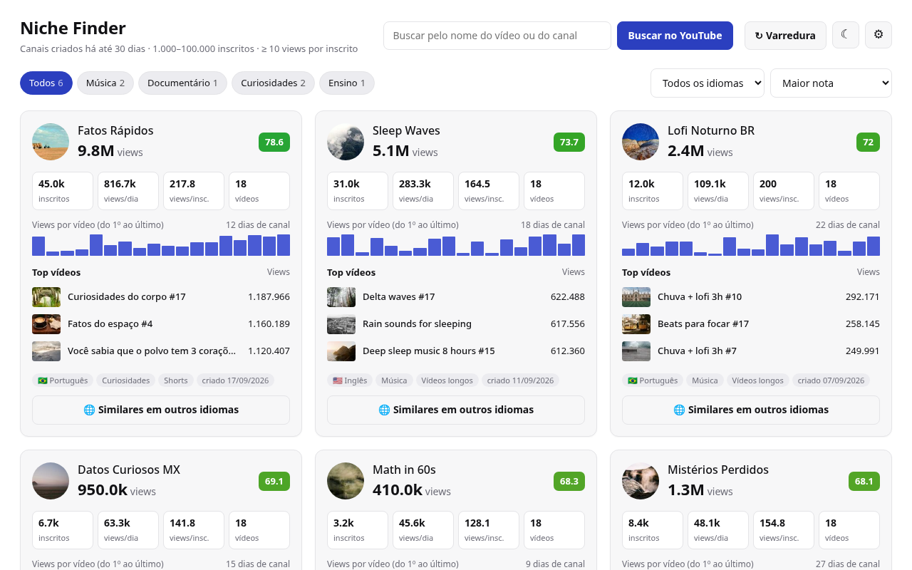
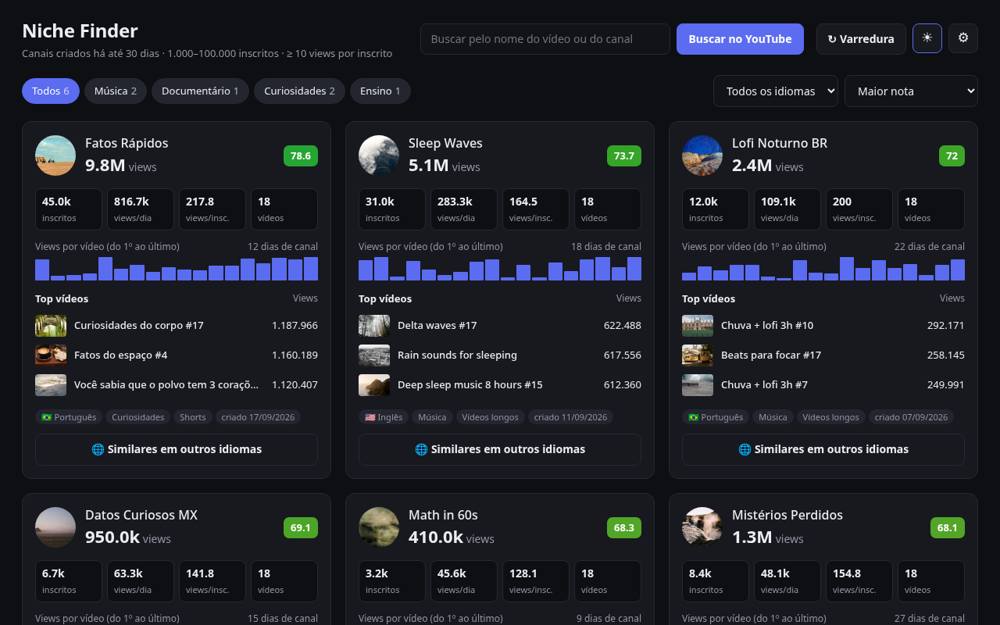
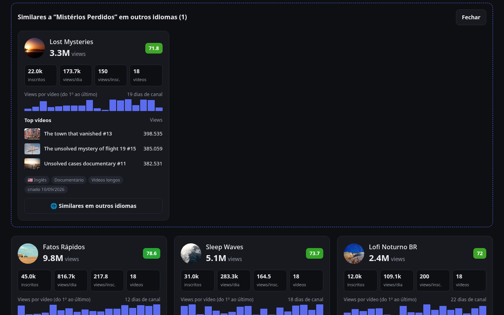
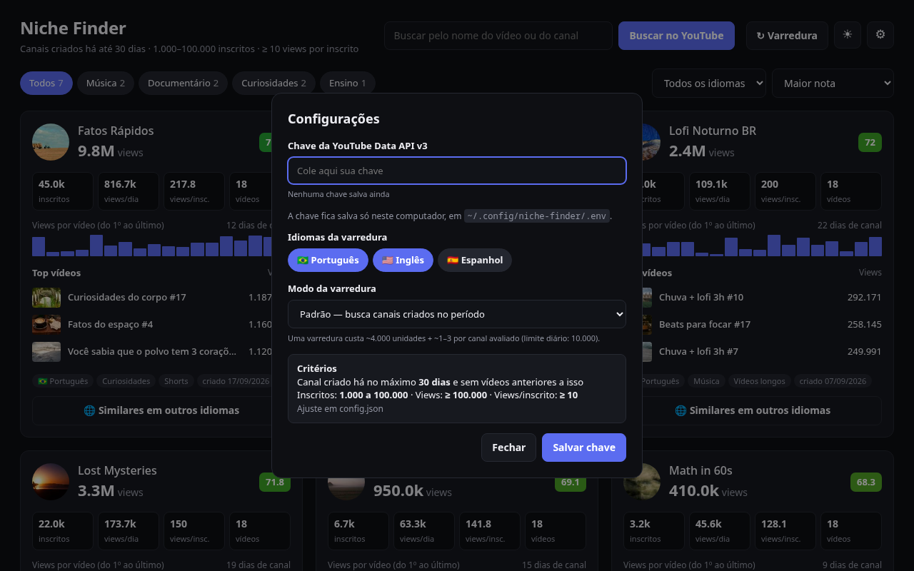

# 🎯 Niche Finder

**Encontre canais do YouTube recém-criados, pequenos e que já estão performando muito bem** nos nichos de **Música**, **Documentário**, **Curiosidades** e **Ensino**, em português, inglês e espanhol.

É uma ferramenta local: roda no seu computador, usa a sua própria chave gratuita da YouTube Data API v3 e mostra tudo num dashboard web com modo claro e escuro.



---

## Sumário

- [Por que usar](#por-que-usar)
- [Funcionalidades](#funcionalidades)
- [Screenshots](#screenshots)
- [Requisitos](#requisitos)
- [Instalação](#instalação)
- [Como obter a chave da YouTube Data API](#como-obter-a-chave-da-youtube-data-api)
- [Uso](#uso)
- [Como funciona](#como-funciona)
- [Configuração (`config.json`)](#configuração-configjson)
- [Cota da API](#cota-da-api)
- [Estrutura do projeto](#estrutura-do-projeto)
- [API local (endpoints)](#api-local-endpoints)
- [Testes e modo demonstração](#testes-e-modo-demonstração)
- [Privacidade e segurança](#privacidade-e-segurança)
- [Limitações conhecidas](#limitações-conhecidas)
- [Solução de problemas](#solução-de-problemas)
- [Contribuindo](#contribuindo)
- [Licença](#licença)

---

## Por que usar

Um canal **criado há poucas semanas** que já tem milhares de inscritos e centenas de milhares de views é um sinal forte de que o nicho **tem demanda e ainda não está saturado**. O Niche Finder automatiza a busca por esses canais e mostra:

- quais nichos estão gerando canais novos que crescem rápido;
- quais vídeos puxaram esse crescimento;
- se o mesmo nicho já existe (ou ainda não existe) em outros idiomas.

## Funcionalidades

| | |
|---|---|
| 🆕 **Só canais novos de verdade** | O canal precisa ter sido **criado** dentro do período (padrão: 30 dias) e **não pode ter vídeos anteriores** a isso. Canais antigos que voltaram a postar e canais com vídeos importados ficam de fora. |
| 📈 **Performance alta** | Filtra por inscritos (padrão: 1.000 a 100.000), views totais e views por inscrito. |
| 🎼 **Gênero detectado pelo conteúdo** | Usa a categoria que o YouTube atribui a cada vídeo e palavras-chave nos títulos. Um vlog não passa como "documentário" só porque apareceu numa busca. |
| 🔎 **Busca pelo nome do vídeo** | Filtra na hora os canais salvos pelo título de qualquer vídeo ou pelo nome do canal. O botão **Buscar no YouTube** procura canais novos sobre o termo digitado. |
| 🌐 **Similares em outros idiomas** | Com um clique, traduz o nicho do canal e busca canais novos do mesmo gênero em outros idiomas. |
| 🏆 **Nota de oportunidade (0–100)** | Combina velocidade de views, eficiência por inscrito e tamanho do canal. |
| 🌗 **Modo claro e escuro** | O tema escolhido fica salvo no navegador. |
| 💸 **Controle de cota** | Mostra o custo estimado antes de cada busca, guarda respostas em cache por 12 h e conta o uso diário. |
| 📦 **Zero dependências** | Apenas a biblioteca padrão do Python 3.10+. Nada de `pip install`. |

## Screenshots

| Modo escuro | Similares em outros idiomas | Configurações |
|---|---|---|
|  |  |  |

> As imagens usam **dados de demonstração** (canais fictícios gerados pelos testes), não canais reais.

## Requisitos

- **Python 3.10 ou mais recente** (Linux, macOS ou Windows)
- Um navegador moderno
- Uma **chave gratuita da YouTube Data API v3** ([como obter](#como-obter-a-chave-da-youtube-data-api))

Nenhuma biblioteca externa é necessária.

## Instalação

```bash
git clone https://github.com/jeffersonmk/niche-finder.git
cd niche-finder
```

Pronto. Não há dependências para instalar.

## Como obter a chave da YouTube Data API

1. Acesse o [Google Cloud Console](https://console.cloud.google.com/) e faça login.
2. Crie um projeto novo (menu do topo → **Novo projeto**).
3. Vá em **APIs e serviços → Biblioteca**, procure **YouTube Data API v3** e clique em **Ativar**.
4. Vá em **APIs e serviços → Credenciais → Criar credenciais → Chave de API**.
5. (Recomendado) Clique na chave criada e, em **Restrições de API**, limite o uso à **YouTube Data API v3**.

A chave é gratuita e vem com **10.000 unidades de cota por dia**. Não é preciso cadastrar cartão para usar só essa API.

## Uso

### 1. Inicie o servidor

```bash
# Linux / macOS
./iniciar.sh

# qualquer sistema
python3 server.py        # no Windows: python server.py
```

O navegador abre em **http://127.0.0.1:8765**.

Opções:

```bash
python3 server.py --port 9000       # usa outra porta
python3 server.py --no-browser      # não abre o navegador automaticamente
python3 server.py --scan            # faz uma varredura completa pelo terminal, sem interface
```

### 2. Configure a chave

Clique em **⚙ Configurações**, cole a chave e clique em **Salvar chave**. O app testa a chave na hora (custa 1 unidade de cota) e mostra se ela funcionou.

A chave é salva em `~/.config/niche-finder/.env`, fora da pasta do projeto, com permissão só para o seu usuário. Também dá para defini-la por variável de ambiente:

```bash
export YT_API_KEY="sua-chave"
```

### 3. Busque canais

| Ação | O que faz | Custo aproximado |
|---|---|---|
| **↻ Varredura** | Busca os 4 gêneros nos idiomas marcados em Configurações | ~4.000 unidades (PT + EN, modo Padrão) |
| **Buscar no YouTube** | Procura canais novos sobre o termo digitado | ~200 unidades por idioma |
| **🌐 Similares em outros idiomas** | Procura o mesmo nicho nos outros idiomas | ~800 unidades |

Antes de gastar cota, o app sempre mostra o custo estimado e pede confirmação.

### 4. Explore os resultados

- **Campo de busca:** digite parte do nome de um vídeo ou canal para filtrar na hora, sem gastar cota. O vídeo que bateu com a busca fica destacado no card.
- **Chips de gênero:** filtram por Música, Documentário, Curiosidades ou Ensino.
- **Idioma e ordenação:** maior nota, mais views por dia, views por inscrito, inscritos por dia, mais novos ou menos inscritos.
- **☾ / ☀:** alterna entre modo escuro e claro.

Cada card mostra:

- avatar, nome (link para o canal), total de views e a **nota**;
- inscritos, views por dia, views por inscrito e número de vídeos;
- gráfico com as views de cada vídeo, do primeiro ao último;
- os 3 vídeos mais vistos (com link);
- etiquetas de idioma, gênero, formato (**Shorts**, **Vídeos longos** ou **Misto**) e data de criação.

Os resultados ficam salvos em `data/channels.json` e se acumulam entre varreduras. Canais que passam da idade máxima são removidos automaticamente na varredura seguinte.

## Como funciona

```
 Palavras-chave por gênero e idioma (config.json)
                      │
                      ▼
 1. search  ── canais criados no período (e, no modo Completo,
               vídeos recentes com mais views)
                      │  candidatos
                      ▼
 2. channels ─ inscritos, views, data de criação
               ✗ fora da faixa de inscritos / views / views por inscrito
               ✗ canal criado antes do período
                      │
                      ▼
 3. playlistItems ─ lista TODOS os vídeos do canal
               ✗ algum vídeo anterior ao período (histórico importado)
                      │
                      ▼
 4. videos  ── categoria, idioma do áudio, duração, views de cada vídeo
               ✗ não se encaixa em nenhum dos 4 gêneros
                      │
                      ▼
 5. nota, ranking e gravação em data/channels.json → dashboard
```

Os filtros mais baratos rodam primeiro. Assim, a maior parte da cota vai para as buscas (100 unidades cada), e não para detalhar canais que seriam descartados.

### Detecção de gênero

| Gênero | Regra |
|---|---|
| **Música** | Pelo menos metade dos vídeos na categoria *Música* (ID 10) do YouTube. |
| **Documentário, Curiosidades, Ensino** | Pelo menos metade dos vídeos em categorias compatíveis (ex.: Educação, Ciência e tecnologia, Entretenimento) **e** palavras-chave do gênero em pelo menos 30% dos títulos. |

As categorias e palavras-chave de cada gênero ficam em `config.json`.

### Nota de oportunidade

```
nota = 100 × ( 0,55 × velocidade  +  0,30 × eficiência  +  0,15 × tamanho )

velocidade = log10(views por dia + 1) / 6          → 1.000.000 de views/dia = máximo
eficiência = log10(views por inscrito + 1) / 3     → 1.000 views/inscrito  = máximo
tamanho    = 1 − log10(inscritos) / 5              → canais menores ganham mais
```

Cada termo é limitado entre 0 e 1. A escala logarítmica evita que um único viral domine o ranking.

### Similares em outros idiomas

Cada gênero tem **conceitos** com a tradução da mesma busca em cada idioma (ex.: `"misterios": {"pt": "mistérios não resolvidos", "en": "unsolved mysteries", "es": "misterios sin resolver"}`). O botão de similares identifica quais conceitos encontraram o canal, busca as traduções nos outros idiomas e mantém só os canais aprovados nos mesmos filtros, do **mesmo gênero** e em **outro idioma**.

## Configuração (`config.json`)

| Chave | Padrão | Descrição |
|---|---|---|
| `max_channel_age_days` | `30` | Idade máxima do canal, em dias. |
| `min_subscribers` | `1000` | Mínimo de inscritos. |
| `max_subscribers` | `100000` | Máximo de inscritos. |
| `min_total_views` | `100000` | Mínimo de views somadas no canal. |
| `min_views_per_sub` | `10` | Mínimo de views por inscrito. |
| `min_genre_match` | `0.5` | Fração mínima de vídeos em categorias do YouTube compatíveis com o gênero. |
| `min_keyword_match` | `0.3` | Fração mínima de títulos com palavras-chave do gênero. |
| `results_per_search` | `50` | Resultados por busca (máximo da API: 50). |
| `similar_max_concepts` | `2` | Quantos conceitos usar ao procurar similares (controla o custo). |
| `scan_languages` | `["pt", "en"]` | Idiomas padrão da varredura (também dá para mudar na interface). |
| `languages` | pt, en, es | Idiomas disponíveis: nome, `regionCode` e `relevanceLanguage` usados na busca. |
| `categories` | 4 gêneros | Para cada gênero: nome, IDs de categoria do YouTube, conceitos traduzidos e palavras-chave. |

### Exemplos

**Afrouxar os filtros** quando vierem poucos resultados:

```json
"max_channel_age_days": 60,
"min_views_per_sub": 5
```

**Adicionar um conceito** (uma nova busca, em todos os idiomas):

```json
"categories": {
  "curiosidades": {
    "concepts": {
      "oceano": { "pt": "curiosidades do oceano", "en": "ocean facts", "es": "curiosidades del océano" }
    }
  }
}
```

Cada conceito novo acrescenta **100 unidades por idioma** ao custo da varredura.

**Adicionar um idioma:** inclua-o em `languages` e adicione a tradução dele em cada conceito:

```json
"languages": {
  "fr": { "label": "Francês", "regionCode": "FR", "relevanceLanguage": "fr" }
}
```

Os IDs de categoria do YouTube mais usados são: `1` Filmes e animação, `10` Música, `19` Viagens, `22` Pessoas e blogs, `24` Entretenimento, `25` Notícias, `26` Guias e estilo, `27` Educação, `28` Ciência e tecnologia.

## Cota da API

A YouTube Data API v3 oferece **10.000 unidades por dia**, e a cota reinicia à **meia-noite do horário do Pacífico** (≈ 04h ou 05h em Brasília, conforme o horário de verão nos EUA).

| Chamada | Custo |
|---|---|
| `search` (busca de canais ou vídeos) | 100 |
| `channels`, `playlistItems`, `videos`, `videoCategories` | 1 |

Custo por operação com a configuração padrão:

| Operação | Cálculo | Total |
|---|---|---|
| Varredura Padrão (PT + EN) | 4 gêneros × 5 conceitos × 2 idiomas × 100 | ~4.000 + detalhes |
| Varredura Completa (PT + EN) | o dobro (canais + vídeos) | ~8.000 + detalhes |
| Varredura Padrão (PT + EN + ES) | 4 × 5 × 3 × 100 | ~6.000 + detalhes |
| Busca livre (2 idiomas) | 2 idiomas × 2 tipos × 100 | ~400 + detalhes |
| Similares | até 2 conceitos × 2 idiomas × 2 tipos × 100 | ~800 + detalhes |

"Detalhes" são de 2 a 6 unidades por canal que passa nos primeiros filtros.

Para economizar:

- respostas iguais em até **12 horas** vêm do cache em `cache/` e não gastam cota;
- o uso do dia aparece no rodapé da interface e fica gravado em `data/quota.json`;
- rode a varredura com menos idiomas, ou remova conceitos pouco úteis do `config.json`.

## Estrutura do projeto

```
niche-finder/
├── server.py            # servidor HTTP local, API e tarefas em segundo plano
├── nf_core.py           # cliente da API, filtros, detecção de gênero, nota, buscas
├── config.json          # critérios, idiomas, gêneros, conceitos e palavras-chave
├── iniciar.sh           # atalho para iniciar (Linux/macOS)
├── web/
│   ├── index.html       # estrutura da interface
│   ├── style.css        # visual (temas claro e escuro)
│   └── app.js           # lógica da interface
├── tests/
│   └── test_offline.py  # testes com a API simulada + modo demonstração
├── docs/                # screenshots do README
├── data/                # (gerado) channels.json e quota.json — ignorado pelo git
└── cache/               # (gerado) respostas da API por 12 h — ignorado pelo git
```

## API local (endpoints)

O servidor escuta só em `127.0.0.1`. Todas as respostas são JSON.

| Método | Rota | Descrição |
|---|---|---|
| `GET` | `/api/state` | Canais salvos, última varredura, cota, se há chave e critérios atuais. |
| `GET` | `/api/estimate?kind=scan&mode=channel&langs=pt,en` | Custo estimado de uma varredura. |
| `GET` | `/api/estimate?kind=similar&channel=<id>` | Custo estimado da busca de similares. |
| `GET` | `/api/job?id=<id>` | Progresso de uma tarefa (`running`, `done` ou `error`). |
| `POST` | `/api/key` | `{"key": "..."}` salva e valida a chave. |
| `POST` | `/api/scan` | `{"langs": ["pt","en"], "mode": "channel"}` inicia uma varredura. |
| `POST` | `/api/search` | `{"query": "...", "langs": ["pt"]}` inicia uma busca livre. |
| `POST` | `/api/similar` | `{"channel": "<id>"}` inicia a busca de similares. |

As rotas `POST` retornam `{"job": "<id>"}`. A interface consulta `/api/job` até a tarefa terminar.

## Testes e modo demonstração

Os testes usam uma **API do YouTube simulada**: não precisam de chave nem de internet e não gastam cota. Os dados ficam numa pasta temporária, sem tocar em `data/`.

```bash
python3 -m unittest discover -s tests -v
```

Os testes verificam que:

- só passam canais novos, pequenos e dos 4 gêneros;
- canais antigos que voltaram a postar e canais com vídeos importados são descartados;
- o gênero é detectado corretamente pelo conteúdo;
- "similares" encontra o mesmo nicho em outro idioma;
- a busca livre, a nota e o contador de cota funcionam.

Para ver a interface com dados fictícios, útil para mexer no front-end:

```bash
python3 tests/test_offline.py --serve     # http://127.0.0.1:8799
```

## Privacidade e segurança

- A chave fica em `~/.config/niche-finder/.env` (permissão `600`), **fora do repositório**. O `.gitignore` também bloqueia qualquer arquivo `.env`.
- O servidor aceita conexões só de `127.0.0.1` e recusa `POST` vindo de outros sites (proteção contra CSRF).
- Nenhum dado é enviado a terceiros: o app só conversa com `googleapis.com`.
- `data/` e `cache/` guardam dados públicos do YouTube e não vão para o git.

> ⚠️ **Nunca publique sua chave.** Se ela vazar, apague-a no Google Cloud Console e crie outra.

## Limitações conhecidas

- **Monetização não é verificada.** A API oficial não informa se um canal é monetizado. O mínimo de 1.000 inscritos é usado como aproximação do requisito do Programa de Parcerias do YouTube.
- **Canais com menos de 30 dias e mais de 1.000 inscritos são raros.** Varreduras podem trazer poucos resultados. Aumente `max_channel_age_days` se precisar.
- **A busca do YouTube não é exaustiva.** Ela devolve no máximo 50 resultados por consulta, então canais que não aparecem para as palavras-chave configuradas não serão encontrados. Mais conceitos significam mais cobertura, mas também mais cota.
- **Canais com inscritos ocultos** são ignorados, porque a API não informa o número.
- **Canais com mais de 200 vídeos** são descartados, porque não dá para confirmar a data do primeiro vídeo sem gastar muita cota. Um canal novo raramente passa disso.
- **Idioma:** vem do idioma de áudio declarado nos vídeos. Quando o canal não declara, é usado o idioma da busca que o encontrou.
- **Termos da API:** o uso deve seguir os [Termos de Serviço das APIs do YouTube](https://developers.google.com/youtube/terms/api-services-terms-of-service). O app guarda os dados só localmente, e canais acima da idade máxima saem do banco a cada varredura.

## Solução de problemas

| Mensagem | Causa e solução |
|---|---|
| *Chave da API não configurada* | Abra ⚙ Configurações e salve a chave, ou defina `YT_API_KEY`. |
| *Chave da API inválida* | Confira se copiou a chave inteira. Se ela tiver restrições, confirme que a YouTube Data API v3 está liberada. |
| *A YouTube Data API v3 não está ativada* | Ative a API na Biblioteca do projeto no Google Cloud (passo 3 da seção da chave). |
| *Cota diária da API esgotada* | Aguarde o reinício à meia-noite do Pacífico. Buscas repetidas continuam vindo do cache. |
| Nenhum canal encontrado | Normal para critérios rígidos. Aumente `max_channel_age_days`, reduza `min_views_per_sub`, use o modo Completo ou adicione conceitos. |
| `Address already in use` | Já existe algo na porta 8765. Use `python3 server.py --port 9000`. |

## Contribuindo

Contribuições são bem-vindas. Sugestões de melhoria:

- novos idiomas e conceitos no `config.json`;
- exportação para CSV ou planilha;
- histórico de crescimento dos canais entre varreduras;
- mais sinais para detectar gênero.

Antes de abrir um PR, rode os testes:

```bash
python3 -m unittest discover -s tests -v
```

## Licença

Distribuído sob a licença [MIT](LICENSE).

> Este projeto não é afiliado ao YouTube nem ao Google. YouTube é marca registrada da Google LLC.
